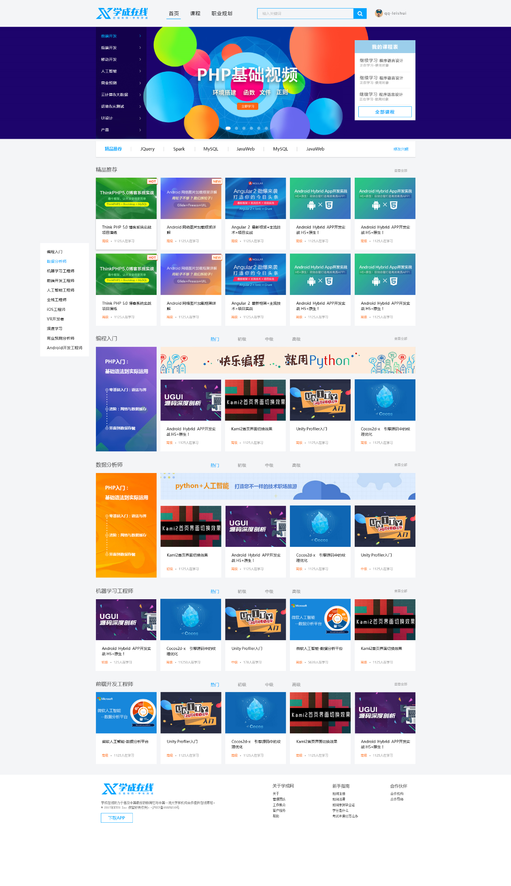
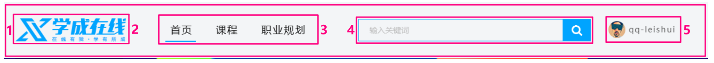
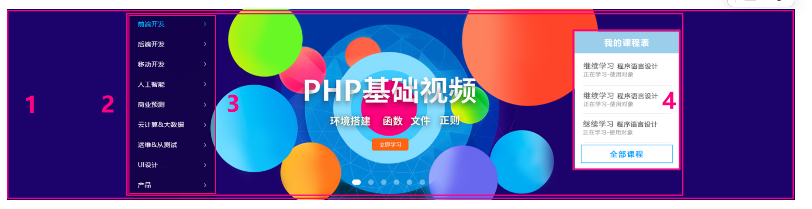
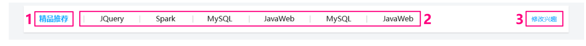
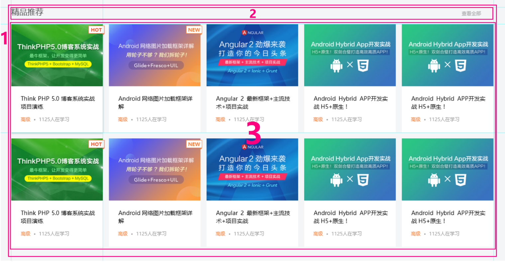
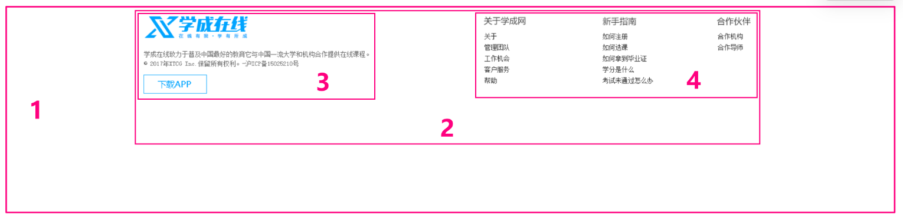
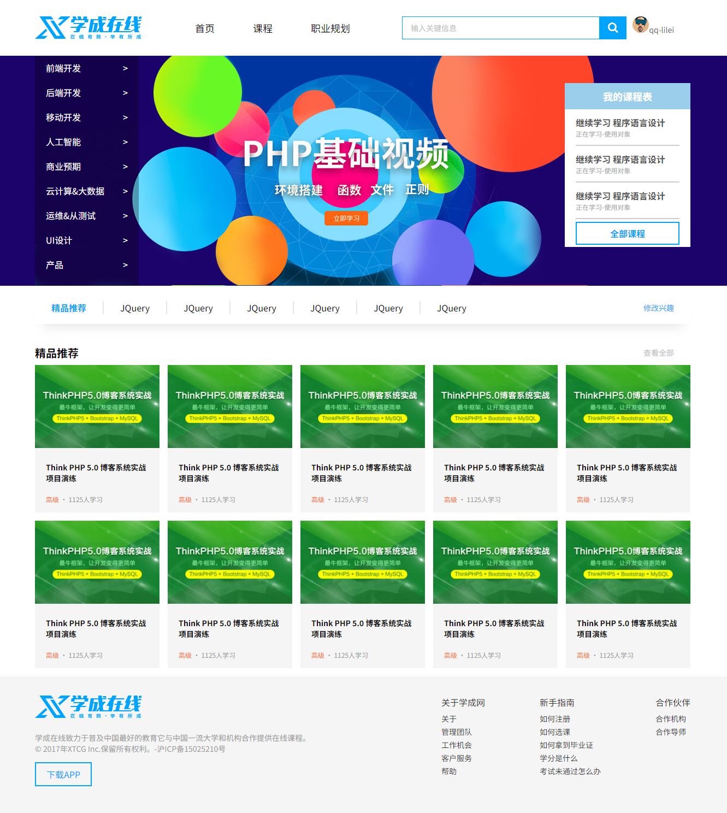

<!--
 * @Description: 
 * @Author: ljl
 * @Date: 2025-04-22 11:28:20
 * @LastEditors: rendc
 * @LastEditTime: 2025-04-23 11:17:53
-->
# 【学成在线案例】



# 一、准备素材和工具

- 学成在线 `PSD` 源文件

- 开发工具 = `PS`（切图）+ `VSCode`（代码）+ `Chrome`（测试）

# 二、案例准备工作

**我们本次采取结构与样式相分离思想：**

1. 创建 `study` 目录文件夹（用于存放我们这个页面的相关内容）
2. `study` 目录内新建 `images` 文件夹，用于保存图片
3. 新建首页文件 `index.html`
4. 新建 `style.css` 样式文件作为我们本次采用的外链样式表
5. 将样式引入到我们的 `HTML` 页面文件中
6. 样式表写入清除内外边距的样式，来检测样式表是否引入成功

# 三、CSS属性书写顺序

**建议遵循以下顺序：**

1. 布局定位属性：`display / position / float / clear / visibility / overflow`（建议 `display` 第一个写，毕竟关系到模式）

2. 自身属性：`width / height / margin / padding / border / background`

3. 文本属性：`color / font / text-decoration / text-align / vertical-align / white- space / break-word`

4. 其他属性（CSS3）：`content / cursor / border-radius / box-shadow / text-shadow / background:linear-gradient …`

```css
.jdc {
	display: block;
	position: relative;
	float: left;
	width: 100px;
	height: 100px;
	margin: 0 10px;
	padding: 20px 0;
	font-family: Arial, 'Helvetica Neue', Helvetica, sans-serif;
	color: #333;
	background: rgba(0,0,0,.5);
	border-radius: 10px;
}
```

# 四、页面布局分析

**为了提高网页制作的效率，布局时通常有以下的布局流程：**

1. 必须确定页面的版心（可视区），我们测量可得知

2. 分析页面中的行模块，以及每个行模块中的列模块。其实页面布局，就是一行行罗列而成的

3. 制作 `HTML` 结构。我们还是遵循，先有结构，后有样式的原则。结构永远最重要

4. 开始运用盒子模型的原理，通过 `div` + `CSS` 布局来控制网页的各个模块

# 五、确定版心

**这个页面的版心是 1200 像素，每个版心都要水平居中对齐，可以定义版心为公共类：**

```css
.w {
	width: 1200px;
	margin: auto;
}
```

# 六、头部制作



- 1 号是版心盒子 `header` `1200 * 42` 的盒子水平居中对齐，上下给一个 `margin` 值就可以
- 版心盒子里面包含 2 号盒子 `logo`
- 版心盒子里面包含 3 号盒子 `nav` 导航栏
- 版心盒子里面包含 4 号盒子 `search` 搜索框
- 版心盒子里面包含 5 号盒子 `user` 个人信息
- 注意：要求里面的 4 个盒子必须都是浮动

导航栏注意点：

实际开发中，我们不会直接用链接 a 而是用 li 包含链接（li + a）的做法。

1. li + a 语义更清晰，一看这就是有条理的列表型内容
2. 如果直接用 a，搜索引擎容易辨别为有堆砌关键字嫌疑（故意堆砌关键字有被搜索引擎降权的风险），从而影响网站排名

# 七、banner 制作



- 1 号盒子是通栏的大盒子 `banner`，不给宽度，给高度，给一个蓝色背景
- 2 号盒子是版心，要水平居中对齐
- 3 号盒子版心内，左对齐 `subnav` 侧导航栏
- 4 号盒子版心内，右对齐 `course` 课程

# 八、精品推荐小模块



- 大盒子水平居中 `goods` 精品，注意此处有个盒子阴影
- 1 号盒子是标题 `h3` 左侧浮动
- 2 号盒子里面放链接左侧浮动， `goods-item` 距离可以控制链接的左右外边距（注意行内元素只给左右内外边距）
- 3 号盒子右浮动 `mod` 修改

# 九、精品推荐大模块



- 1 号盒子为最大的盒子， `box` 版心水平居中对齐
- 2 号盒子为上面部分，`box-hd` 里面左侧标题 `h3` 左浮动，右侧链接 `a` 右浮动
- 3 号盒子为底下部分，`box-bd` 里面是无序列表，有 10 个小 `li` 组成
- 小 `li` 最右侧外边距的问题，这里有个小技巧：给 `box-bd` 里的 `ul` 宽度为 `1215` 就可以一行装开 `5` 个 `li`，因为 `ul` 为块级元素，当块级元素宽度大于父元素宽度时，块级元素不会自动换行。

复习点：我们用到清除浮动，因为 `box-hd` 里面的盒子个数不一定是多少，所以我们就不给高度了，但是里面的盒子浮动会影响下面的布局，因此需要清除浮动。

# 十、底部模块



- 1 号盒子是通栏大盒子，底部 `footer` 给高度，底色是白色
- 2 号盒子版心水平居中
- 3 号盒子版权 `copyright` 左对齐
- 4 号盒子链接组 `links` 右对齐

# 十一、代码

- `index.html`
```html
<!DOCTYPE html>
<html lang="en">
<head>
    <meta charset="UTF-8">
    <meta name="viewport" content="width=device-width, initial-scale=1.0">
    <title>学成在线</title>
    <link rel="stylesheet" href="style.css">
</head>
<body>
    <!-- 1.头部（logo+导航+搜索框+用户） -->
    <div class="header w">
        <!-- Logo -->
         <div class="logo">
            </img>
         </div>
         <!-- 导航 -->
          <div class="nav">
            <ul>
                <li><a href="#">首页</a></li>
                <li><a href="#">课程</a></li>
                <li><a href="#">职业规划</a></li>
            </ul>
          </div>
          <!-- 搜索框 -->
           <div class="search">
            <input type="text" value="输入关键信息">
            <button></button>
           </div>
           <!-- 用户 -->
            <div class="user">
                qq-lilei</img>
            </div>
    </div>

    <!-- 2.banner -->
    <div class="banner">
        <!-- 版心 -->
        <div class="w">
            <div class="subnav">
                <ul>
                    <li><a href="#">前端开发<span>&gt;</span></a></li>
                    <li><a href="#">后端开发<span>&gt;</span></a></li>
                    <li><a href="#">移动开发<span>&gt;</span></a></li>
                    <li><a href="#">人工智能<span>&gt;</span></a></li>
                    <li><a href="#">商业预期<span>&gt;</span></a></li>
                    <li><a href="#">云计算&大数据<span>&gt;</span></a></li>
                    <li><a href="#">运维&从测试<span>&gt;</span></a></li>
                    <li><a href="#">UI设计<span>&gt;</span></a></li>
                    <li><a href="#">产品<span>&gt;</span></a></li>
                </ul>
            </div>
            <!-- 课程模块 -->
            <div class="course">
                <h2>我的课程表</h2>
                <div class="bd">
                    <ul>
                        <li>
                            <h4>继续学习 程序语言设计</h4>
                            <p>正在学习-使用对象</p>
                        </li>
                        <li>
                            <h4>继续学习 程序语言设计</h4>
                            <p>正在学习-使用对象</p>
                        </li>
                        <li>
                            <h4>继续学习 程序语言设计</h4>
                            <p>正在学习-使用对象</p>
                        </li>
                    </ul>
                    <a href="#" class="more">全部课程</a>
                </div>
            </div>
        </div>
    </div>
    
    <!-- 3. 精品推荐 -->
    <div class="goods w">
        <h3>精品推荐</h3>
        <ul>
            <li><a href="#">JQuery</a></li>
            <li><a href="#">JQuery</a></li>
            <li><a href="#">JQuery</a></li>
            <li><a href="#">JQuery</a></li>
            <li><a href="#">JQuery</a></li>
            <li><a href="#">JQuery</a></li>
        </ul>
        <a href="#" class="mod">修改兴趣</a>
    </div>

    <!-- 4. 内容课程 -->
    <div class="box w">
        <div class="box-hd">
            <h3>精品推荐</h3>
            <a href="#">查看全部</a>
        </div>
        <div class="box-bd">
            <ul class="clearfix">
                <li>
                    
                    <h4>Think PHP 5.0 博客系统实战项目演练</h4>
                    <div class="info">
                        <span>高级</span> ・ 1125人学习
                    </div>
                </li>
                <li>
                    
                    <h4>Think PHP 5.0 博客系统实战项目演练</h4>
                    <div class="info">
                        <span>高级</span> ・ 1125人学习
                    </div>
                </li><li>
                    
                    <h4>Think PHP 5.0 博客系统实战项目演练</h4>
                    <div class="info">
                        <span>高级</span> ・ 1125人学习
                    </div>
                </li><li>
                    
                    <h4>Think PHP 5.0 博客系统实战项目演练</h4>
                    <div class="info">
                        <span>高级</span> ・ 1125人学习
                    </div>
                </li><li>
                    
                    <h4>Think PHP 5.0 博客系统实战项目演练</h4>
                    <div class="info">
                        <span>高级</span> ・ 1125人学习
                    </div>
                </li><li>
                    
                    <h4>Think PHP 5.0 博客系统实战项目演练</h4>
                    <div class="info">
                        <span>高级</span> ・ 1125人学习
                    </div>
                </li><li>
                    
                    <h4>Think PHP 5.0 博客系统实战项目演练</h4>
                    <div class="info">
                        <span>高级</span> ・ 1125人学习
                    </div>
                </li><li>
                    
                    <h4>Think PHP 5.0 博客系统实战项目演练</h4>
                    <div class="info">
                        <span>高级</span> ・ 1125人学习
                    </div>
                </li><li>
                    
                    <h4>Think PHP 5.0 博客系统实战项目演练</h4>
                    <div class="info">
                        <span>高级</span> ・ 1125人学习
                    </div>
                </li>
                <li>
                    
                    <h4>Think PHP 5.0 博客系统实战项目演练</h4>
                    <div class="info">
                        <span>高级</span> ・ 1125人学习
                    </div>
                </li>
            </ul>
        </div>
    </div>

    <!-- 5. 底部 -->
    <div class="footer">
        <div class="w clearfix">
            <div class="footer-left">
                
                <p>
                    学成在线致力于普及中国最好的教育它与中国一流大学和机构合作提供在线课程。<br>
                    ? 2017年XTCG Inc.保留所有权利。-沪ICP备15025210号
                </p>
                <a href="#" class="app">下载APP</a>
            </div>
            <div class="footer-right">
                <dl>
                    <dt>关于学成网</dt>
                    <dd><a href="#">关于</a></dd>
                    <dd><a href="#">管理团队</a></dd>
                    <dd><a href="#">工作机会</a></dd>
                    <dd><a href="#">客户服务</a></dd>
                    <dd><a href="#">帮助</a></dd>
                </dl>
                <dl>
                    <dt>新手指南</dt>
                    <dd><a href="#">如何注册</a></dd>
                    <dd><a href="#">如何选课</a></dd>
                    <dd><a href="#">如何拿到毕业证</a></dd>
                    <dd><a href="#">学分是什么</a></dd>
                    <dd><a href="#">考试未通过怎么办</a></dd>
                </dl>
                <dl>    
                    <dt>合作伙伴</dt>
                    <dd><a href="#">合作机构</a></dd>
                    <dd><a href="#">合作导师</a></dd>
                </dl>
            </div>
        </div>
    </div>
</body>
</html>
```
- `style.css`
```css
*{
    margin: 0;
    padding: 0;
}
.w{
    width: 1200px;
    margin: auto;
}
li{
    list-style: none;
}
a{
    text-decoration: none;
}
.clearfix:before,
.clearfix:after {
    content: "";
    display: table;
}

.clearfix:after {
    clear: both;
}

.clearfix {
    *zoom: 1;
}
body{
    background-color: 244, 245, 247;
}

/* header区域 */
.header{
    height: 42px;
    margin: 30px auto;
}
.logo{
    float: left;
    width: 198px;
    height: 42px;
}
.nav{
    float: left;
    margin-left: 60px;
}
.nav li{
    float: left;
    margin: 0 15px;
}
.nav li a{
    display: block;
    height: 42px;
    padding: 0 20px;
    line-height: 42px;
    font-size: 18px;
    color: #050505;
}
.nav li a:hover{
    color: #00a4ff;
    border-bottom: 2px solid #00a4ff;
}
.search{
    float: left;
    width: 412px;
    height: 42px;
    margin-left: 60px;
}
.search input{
    float: left;
    width: 345px;
    height: 40px;
    border: 1px solid #00a4ff;
    padding-left: 15px;
    color: #bfbfbf;
    font-size: 14px;
    border-right: 0;
}
.search button{
    float: left;
    width: 50px;
    height: 42px;
    border: 0;
    background: url(images/btn.png);
}
.user{
    float: right;
    line-height: 42px;
    margin-right: 30px;
    font-size: 14px;
    color: #666;
}
/* banner区域 */
.banner{
    height: 421px;
    background-color: #1c036c;
}
.banner .w{
    height: 421px;
    background: url(images/banner2.png);
}
.subnav{
    float: left;
    width: 190px;
    height: 421px;
    background-color: rgba(0,0,0,0.3);
}
.subnav ul li{
    height: 45px;
    line-height: 45px;
    padding: 0 20px;
}
.subnav ul li a{
    font-size: 16px;
    color: #fff;
}
.subnav ul li a span{
    float: right;
}
.subnav ul li a:hover{
    color: #00a4ff;
}
.course{
    float: right;
    height: 300px;
    width: 230px;
    background-color: #fff;
    margin-top: 50px;
}
.course h2{
    height: 48px;
    font-size: 18px;
    background-color: #9bceea;
    line-height: 48px;
    color: #fff;
    text-align: center;
}
.bd{
    padding: 0 20px;
}
.bd ul li{
    padding: 12px 0;
    border-bottom: 2px solid #ccc;
}
.bd ul li h4{
    font-size: 16px;
    color: #4e4e4e;
}
.bd ul li p{
    font-size: 12px;
    color: #a5a5a5;
}
.bd .more{
    display: block;
    height: 38px;
    line-height: 38px;
    border: 2px solid #00a4ff;
    color: #00a4ff;
    font-size: 16px;
    font-weight: 700;
    text-align: center;
    margin-top: 5px;
}

/* 精品推荐模块 */
.goods{
    height: 60px;
    background-color: #fff;
    margin-top: 10px;
    box-shadow: 0px 20px 20px -15px rgba(0, 0, 0, 0.1);
    /* 行高会继承， 会继承给3个孩子 */
    line-height: 60px;
}
.goods h3{
    float: left;
    font-size: 16px;
    color: #00a4ff;
    margin-left: 30px;
}
.goods ul{
    float: left;
    margin-left: 30px;
}
.goods ul li{
    float: left;
}
.goods ul li a{
    color: #050505;
    font-size: 16px;
    padding: 0 30px;
    border-left: 2px solid #e5e5e5;
}
.goods ul li a:hover{
    color: #00a4ff;
}   
.mod{
    float: right;
    padding: 0 30px;
    color: #00a4ff;
    font-size: 14px;
}

/* 内容课程 */
.box{
    padding-top: 30px;
}
.box-hd{
    height: 45px;
    line-height: 45px;
}
.box-hd h3{
    float: left;
    font-size: 20px;
    color: #050505;
}
.box-hd a{
    float: right;
    font-size: 14px;
    color: #c1c1c1;
    margin: 0 30px;
}
.box-bd ul{
    width: 1225px;
}
.box-bd ul li{
    float: left;
    width: 228px;
    height: 270px;
    background-color: #f5f5f5;
    margin-right: 15px;
    margin-bottom: 15px;
}
.box-bd img{
    width: 100%;
}
.box-bd h4{
    font-size: 14px;
    color: #050505;
    margin: 20px;
    /* font-weight: 400; */
}
.box-bd .info{
    font-size: 12px;
    color: #999;
    margin: 0 20px;
}
.box-bd .info span{
    color: #ff6600;
}

/* 底部 */
.footer{
    height: 415px;
    background-color: #f5f5f5;
}
.footer .w{
    /* 注意：此处对 footer 里的 w 设置 margin 会发生外边距塌陷， 
    因为，w 包含在 footer 中，w 的上外边距为 35px，footer 的外边距为 0px， 
    此时发生外边距塌陷，父元素塌陷较大的外边距值 35px*/
    /* margin-top: 35px; */
    padding-top: 35px;
    /* padding 不会发生边距合并 */
}
.footer-left{
    float: left;
}
.footer-left p{
    font-size: 14px;
    color: #999;
    margin: 20px 0 15px 0;
}
.footer-left .app{
    display: block;
    width: 100px;
    height: 40px;
    line-height: 40px;
    text-align: center;
    border: 2px solid #00a4ff;
    color: #00a4ff;
}
.footer-right{
    float: right;
}
.footer-right dl{
    float: left;
    margin-left: 100px;
}
.footer-right dl dt{
    font-size: 16px;
    color: #333;
    margin-bottom: 5px;
}
.footer-right dl dd a{
    color: #333;
    font-size: 14px;
}
.footer-right dl dd a:hover{
    color: pink;
}
```
