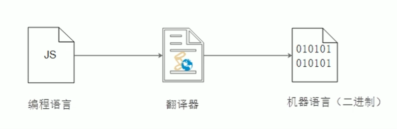
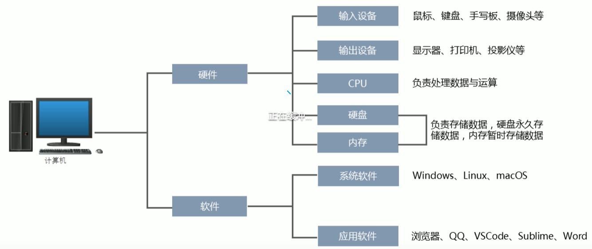
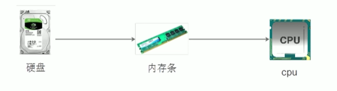

<!--
 * @Description: 
 * @Author: ljl
 * @Date: 2025-05-15 10:15:18
 * @LastEditors: rendc
 * @LastEditTime: 2025-05-15 18:56:43
-->
# 【计算机编程语言】

# 一、编程语言

## 1.1编程

**编程**：就是让计算机为解决某个问题而使用某种程序设计语言编写程序代码，并最终得到结果的过程。
**计算机程序**：就是计算机所执行的一系列的`指令集合`，而程序全部都是我们所掌握的语言来编写的，所以人们要控制计算机一定要通过计算机语言向计算机发出命令。

`注意：上面所定义的计算机指的是任何能够执行代码的设备，可能是智能手机、ATM机、服务器等等。`

## 1.2计算机语言

**计算机语言**：指用于`人与计算机之间通讯的语言`，它使人与计算机之间传递信息的`媒介`

**计算机语言的分类**：机器语言、汇编语言和高级语言。
实际上最终执行的都是`机器语言`，由“0”和“1”组成的二进制数，`二进制是计算机语言的基础`
|十进制|二进制|十进制|二进制|
|:----:|:----:|:----:|:----:|
| 0 |00000000| 1 |00000001|
| 2 |00000010| 3 |00000011|
| 4 |00000100| 5 |00000101|
| 6 |00000110| 7 |00000111|
| 8 |00001000| 9 |00001001|
| 10 |00001010|

## 1.3编程语言

可以通过类似于人类的“语言”来控制计算机，让计算机为我们做事情，这样的语言就叫做编程语言（Programming Language） 
编程语言是用来控制计算机的一系列指令，他有固定的格式和词汇（不同编程语言的格式词汇不一样），必须遵守。 
通用的编程语言有：
- **汇编语言** 和机器语言实质是相同的，都是直接对硬件操作，只不过指令采用了英文缩写的标识符，容易识别和记忆。
- **高级语言** 主要是相对于低级语言而言，它并不是特指某一种具体的语言，而是包括了很多编程语言，常用的有C语言，C++，Java，Python，C#，JavaScript，PHP，Ruby，Perl，Lua，Go，Swift等。
>C语言：puts("Hello World"); 
>PHP：echo "Hello World"; 
>Java：System.out.println("Hello World"); 
>JavaScript：alert("Hello World");

## 1.4 翻译器
高级语言所编制的程序不能直接被计算机识别，必须经过转换才能被执行，所以我们需要一个翻译器，来将高级语言程序翻译成计算机可以识别的机器语言，而被称为二进制化。记住1和0。

## 1.5 编程语言和标记语言的区别
- **编程语言**：有很强的逻辑和行为能力，在编程语言里，你会看到很多的if else、for、while等具有逻辑性和行为能力的指令们这是主动的。
- **标记语言**：（html）不用于向计算机发出指令，常用于格式化和链接。标记语言的存在是用来被读取的，他是被动的。

### 总结：
1. 计算机可以帮助人类解决某些问题
2. 程序员利用编程语言编写程序发出指令控制计算机来实现这些任务
3. 编程语言有机器语言、汇编语言、高级语言
# 二、计算机基础

## 2.1 计算机组成

## 2.2 数据存储
1. 计算机内部使用二进制 0 和 1 来表示数据。
2. 所有数据，包括文件、图片等最终都是以二进制数据（0和1）的形式存放在硬盘中的。
3. 所有程序，包括操作系统，本质都是各种数据，也以二进制数据的形式存放在硬盘中。平时我们所说的安装软件，其实就是把程序文件复制到硬盘中。
4. 硬盘、内存都是保存的二进制数据。

## 2.3 数据的存储单位
bit < byte <kb < GB < TB <...
- 位（bit）：1bit可以保存一个0或者1，`最小的存储单位`
- 字节（Byte）：`1B = 8b`
- 千字节（KB）：`1KB = 1024B`
- 兆字节（MB）：`1MB = 1024KB`
- 吉字节（GB）：`1GB = 1024MB`
- 太字节（TB）：`1TB = 1024GB`
- ...

## 2.4 程序运行

1. 打开某个程序时，先从硬盘中把程序的代码加载到内存中
2. CPU执行内存中的代码
> **注意：** 之所以要内存的一个重要原因，是因为CPU运行太快了，如果只从硬盘中读数据，会浪费cpu性能，所以，才使用存取速度更快的内存来保存运行时的数据。（内存是电，硬盘是机械）