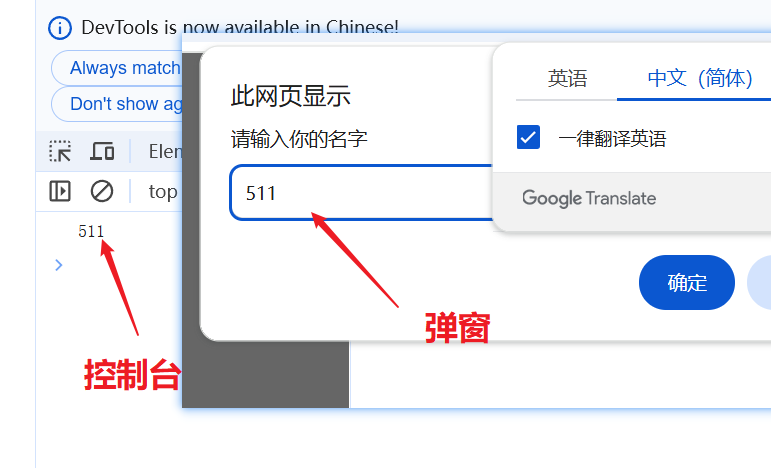

<!--
 * @Description: 
 * @Author: ljl
 * @Date: 2025-05-15 19:02:47
 * @LastEditors: rendc
 * @LastEditTime: 2025-05-16 10:27:46
-->
# 【JavaScript基础、变量、数据类型】

# 一、初识 JavaScript

## 1.1 JavaScript 是什么

> - 布兰登・艾奇（Brendan Eich）。
> - 神奇的大哥用10天完成JavaScript 设计。
> - 最初命名为LiveScript，后来在与Sun合作之后将其改名为JavaScript。

- JavaScript 是世界上最流行的语言之一，是一种运行在客户端的脚本语言（Script 是脚本的意思）
- 脚本语言：不需要编译，运行过程中由js解释器（js引擎）逐行来进行解释并执行
- 现在也可以基于Node.js技术进行服务器端编程

## 1.2 JavaScript 的作用
- 表单动态校验（密码强度检测） （**JS产生最初的目的**）
- 网页特效
- 服务端开发(Node.js)
- 桌面程序(Electron)
- App(Cordova)
- 控制硬件-物联网(Ruff)
- 游戏开发(cocos2d-js)

## 1.3 HTML/CSS/JS 的关系

**HTML/CSS 标记语言--描述类语言**

- HTML 决定网页结构和内容( 决定看到什么)，相当于人的身体

- CSS 决定网页呈现给用户的模样( 决定好不好看)，相当于给人穿衣服、化妆

**JS 脚本语言--编程类语言**

- 实现业务逻辑和页面控制( 决定功能)，相当于人的各种动作

## 1.4 浏览器执行 JS 简介

浏览器分成两部分：渲染引擎和JS 引擎

- **渲染引擎**：用来解析HTML与CSS，俗称内核，比如chrome 浏览器的blink，老版本的webkit

- **JS 引擎**：也称为JS 解释器。用来读取网页中的JavaScript代码，对其处理后运行，比如chrome 浏览器的V8

`浏览器本身并不会执行JS代码，而是通过内置JavaScript 引擎(解释器) 来执行JS 代码。JS 引擎执行代码时逐行解释每一句源码（转换为机器语言），然后由计算机去执行，所以JavaScript 语言归为脚本语言，会逐行解释执行。`

## 1.5 JS 的组成


### 1.ECMAScript

**ECMAScript**是由ECMA 国际（原欧洲计算机制造商协会）进行标准化的一门编程语言，这种语言在万维网上应用广泛，它往往被称为JavaScript 或 JScript，但实际上后两者是ECMAScript语言的实现和扩展。


`ECMAScript：ECMAScript 规定了JS的编程语法和基础核心知识，是所有浏览器厂商共同遵守的一套JS语法工业标准。`

更多参看MDN：https://developer.mozilla.org/zh-CN/docs/Web/JavaScript/JavaScript_technologies_overview

### 2.DOM-文档对象模型
**文档对象模型**：（Document Object Model，简称DOM），是W3C组织推荐的处理可扩展标记语言的`标准编程接口`。通过DOM提供的接口可以对页面上的各种元素进行操作（大小、位置、颜色等）。

### 3.BOM-浏览器对象模型
**浏览器对象模型**：（Browser Object Model，简称BOM），是指浏览器对象模型，它提供了独立于内容的、可以与浏览器窗口进行互动的对象结构。`通过BOM可以操作浏览器窗口，比如弹出框、控制浏览器跳转、获取分辨率等。`

## 1.6 JS初体验

JS有3种书写位置，分别为行内、内嵌和外部。
### 1. 行内式
```JS
<input type="button" value="点我试试" onclick="alert('Hello World')" />
```

- 可以将单行或少量JS代码写在HTML标签的事件属性中（以
on 开头的属性），如：onclick
- 注意单双引号的使用：在`HTML`中我们推荐使用`双引号`，`JS`中我们推荐使用`单引号`
- 可读性差，在html中编写JS大量代码时，不方便阅读；
- 引号易错，引号多层嵌套匹配时，非常容易弄混；
- 特殊情况下使用

### 2. 内嵌式
```Javascript
<script>
    alert('HelloWorld~!');
</script>
```

- 可以将多行JS代码写到 `script` 标签中

- 内嵌JS 是学习时常用的方式 

### 3. 外联式
```js
<script src="my.js"></script>
```
- 利于HTML页面代码结构化，把大段JS代码独立到HTML页面之外，既美观，也方便文件级别的复用
- 引用外部JS文件的script 标签中间不可以写代码
- 适合于JS 代码量比较大的情况

# 二、JavaScript注释

## 2.1 单行注释

为了提高代码的可读性，JS与CSS一样，也提供了注释功能。JS中的注释主要有两种，分别是`单行注释`和`多行注释`。
单行注释的注释方式如下：
> // 我是一行文字，不想被JS引擎执行，所以注释起来
//用来注释单行文字（ 快捷键 ctrl + /）

## 2.2 多行注释
多行注释的注释方式如下：
```
/*
    获取用户年龄和姓名
    并通过提示框显示出来
*/
```
/* */用来注释多行文字（默认快捷键 alt + shift+ a）

快捷键修改为： ctrl + shift + /

vscode -> 首选项按钮 -> 键盘快捷方式 -> 查找原来的快捷键 -> 修改为新的快捷键 -> 回车确认

# 三、JavaScript输入输出语句

为了方便信息的输入输出，JS中提供了一些输入输出语句，其常用的语句如下：
|方法|说明|归属|
|:---:|:---:|:---:|
|alert(msg)|浏览器弹出警示框|浏览器|
|console.log(msg)|浏览器控制台打印输出信息|浏览器|
|prompt(msg)|浏览器弹出输入框，用户可以输入|浏览器|

**注意：** alert() 主要用来显示消息给用户，console.log() 用来给程序员自己看运行时的消息。

```html
<!DOCTYPE html>
<html lang="en">
<head>
    <meta charset="UTF-8">
    <meta name="viewport" content="width=device-width, initial-scale=1.0,maximum-scale=1.0,minimum-scale=1.0,user-scalable=no">
    <title>Document</title>
    <script>
        // 这是一个输入框
        prompt('请输入一个数字');
        // alert 弹出警示框 输出的 展示给用户的
        alert('计算的结果是');
        // console.log 控制台输出 给程序员看
        console.log('我是程序员看到的');
    </script>
</head>
<body>

</body>
</html>
```


# 四、变量

变量：计算机语言中能储存计算结果或能表示值的抽象概念。

> 白话：变量就是一个装东西的盒子。
> 
> 通俗：变量不是数值本身，它们仅仅是一个用于`存储数值的容器`！
>
> 本质：是程序在`内存`中申请的一块用来存放数据的`空间`

## 4.1 定义变量

要想使用变量，第一步就是声明它，并给它赋值。

```javascript
var a = 22;
var b = '零距离';
```

- `var` 定义变量的关键字
- `a` 变量名
- `=` 赋值符号
- `24` 变量值

## 4.2 使用变量

当变量被赋值后，就可以使用它了。

```javascript
console.log(a);
console.log(b);
```

> 注意：使用变量时，变量名不能用引号包裹，否则会被识别为字符串！


```javascript
// 输入名字
var myname = prompt("请输入你的名字");
// 输出名字
console.log(myname);
```

## 4.3 改变变量的值

变量的值可以通过再次赋值被改变，改变变量的值时不需要再书写 `var` 关键字。

```javascript
// 1. 改变变量
var a = 511;
a = 527;
console.log(a);

// 2. 声明多个变量
var a = 511, b = 527, c = 538;

// 3. 声明的特殊情况
// 3.1 只声明不赋值
var a;
console.log(a); // undefined
// 3.2 不声明 不赋值
console.log(b); // 报错
// 3.3 不声明直接赋值
c = 538;
console.log(c); // 538
```


【注意事项】

- 变量声明提升是 JS 的独有特性！
- 在实际开发中，不要刻意使用变量提升的特性，一定要先定义再使用！
- 严格模式对变量提升没有约束作用，严格模式是不对变量提升进行报错的！


## 4.4 变量的合法命名

- 只能由 `字母`、`数字`、`_`、`$` 组成，但不能以数字开头（建议普通代码一律以字母开头）
- 不能是 关键字 或 保留字。 例如：var、for ...
- 变量名大小写敏感，a 和 A 是两个不同的变量
- 变量名要有意义，不要拼音简写，name特殊，尽量不用。

> 函数、类名、对象的属性等也都要遵守这个标识符的命名规则！

## 4.5 推荐的变量命名风格

- 小驼峰命名法：`mathTestScore`（吐血推荐）
- C 风格变量命名法：`math_test_score`

> - 驼峰命名法：Java、JavaScript
>
> - 下划线命名法：C、C++、Python、Golang、SQL

## 4.6 变量的默认值

- 一个变量只定义，但没有赋初值，默认值是 `undefined`（未定义）
- 一个变量只有被 `var` 定义，并赋初值之后，才算正式初始化完成

```javascript
var a;	// 只定义但没有赋初值
console.log(a);	// undefined
a = 24;
console.log(a);	// 24
```

### 案例

> **问题：交换两个变量的值**

```javascript
// js是编程语言 有很强的逻辑型在里面 实现这个要求的思路 先怎么做后怎么做
// 1. 需要一个临时变量
// 2.把apple1 给临时变量
// 3.把apple2 给apple1
// 4.把临时变量给apple2
var temp; // 临时变量
var apple1 = '苹果1';
var apple2 = '苹果2';
temp = apple1;
apple1 = apple2;
apple2 = temp;
console.log(apple1,apple2);
```

## 4.7 变量的常见错误

- 不用 `var` 定义，而直接将值赋予它，虽然不引发报错，但会产生严重的作用域问题。

> 请一律加上 `var` ！

```javascript
a = 24; // 未使用 var 定义的变量默认为全局变量！成为 window 对象的属性。
console.log(a);	// 24
console.log(window.a);	// 24
console.log(window.a === a);	// true
```

> 关于作用域的问题，后面会介绍。

- 尝试使用一个既没有被 `var` 定义过，也没有赋过值的变量，就会产生引用错误。

```javascript
console.log(c);
// index.js:1 Uncaught ReferenceError: c is not defined at index.js:1
```

> **使用 strict 严格模式**
>
> JavaScript 在设计之初，为了方便初学者学习，并不强制要求用 `var` 申明变量。这个设计错误带来了严重的后果：如果一个变量没有通过 `var` 申明就被使用，那么该变量就自动被申明为全局变量：
>
> ```javascript
> i = 10; // i 现在是全局变量
> ```
>
> 在同一个 HTML 页面的不同的 JavaScript 文件中，如果都不用 `var` 申明，恰好都使用了变量 `i`，将造成变量 `i` 互相影响，产生难以调试的错误结果。
>
> 使用 `var` 申明的变量则不是全局变量，它的范围被限制在该变量被申明的 JS 文件或函数体内（函数的概念将稍后讲解），同名变量在不同的函数体内互不冲突。
>
> 为了修补 JavaScript 这一严重设计缺陷，ECMA 在后续规范中推出了 strict 模式，在 strict 模式下运行的 JavaScript 代码，强制通过 `var` 申明变量，未使用 `var` 申明变量就使用的，将导致运行错误。
>
> 启用 strict 模式的方法是在 JavaScript 代码的第一行写上：
>
> ```javascript
> "use strict";
> ```
>
> 这是一个字符串，不支持 strict 模式的浏览器会把它当做一个字符串语句执行，支持 strict 模式的浏览器将开启 strict 模式运行 JavaScript。
>
> ```javascript
> "use strict";
> abc = "Hello, world";
> console.log(abc);
> // 如果浏览器支持 strict 模式，
> // 下面的代码将报 ReferenceError 错误：Uncaught ReferenceError: abc is not defined
> ```
>
> 不用 `var` 申明的变量会被视为全局变量，为了避免这一缺陷，所有的 JavaScript 代码都推荐使用 strict 模式。
>
> 提示：`"use strict"` 语句可以放在 JS 代码的任意一行上，并且它只对它所在作用域下方的代码起作用。

## 4.8 等号表示赋值

```javascript
var a = 10;
a = a + 1;
console.log(a);	// 11
a = a - 1;
console.log(a);	// 10
```

2