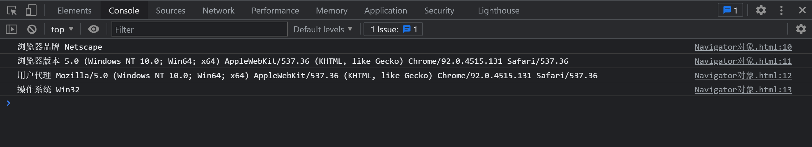
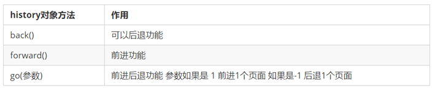
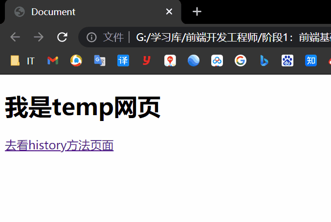
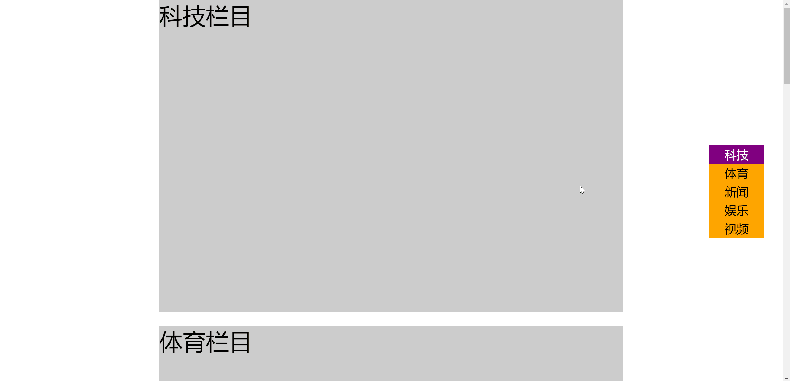

<!--
 * @Description: 
 * @Author: ljl
 * @Date: 2025-05-19 09:16:56
 * @LastEditors: rendc
 * @LastEditTime: 2025-06-04 15:34:35
-->
# 【BOM】

# 一、BOM是什么

BOM（Browser Object Model，浏览器对象模型）是 JS 与 浏览器窗口交互的接口。

一些与浏览器改变尺寸、滚动条滚动相关的特效，都要借助 BOM 技术。

# 二、window对象

window 对象是当前 JS 脚本运行所处的窗口，而这个窗口中包含 DOM 结构，`window.document` 属性就是 `document` 对象。

在有标签功能的浏览器中，每个标签都拥有自己的 `window` 对象；也就是说，同一个窗口的标签页之间不会共享一个 window 对象。

# 三、全局变量是window的属性

全局变量会成为 window 对象的属性。

```javascript
var a = 10;
console.log(window.a == a);	// true
```

这就意味着，多个 js 文件之间是共享全局作用域的，即：js 文件没有作用域隔离功能。

# 四、内置函数普遍是window的方法

如 `setInterval()`、`alert()` 等内置函数，普遍是 window 的方法。

```javascript
console.log(window.alert == alert);	// true
console.log(window.setInterval == setInterval);	// true
```

# 五、窗口尺寸相关属性

| 属性          | 意义                                                     |
| ------------- | -------------------------------------------------------- |
| `innerHeight` | 浏览器窗口的内容区域的高度，包含水平滚动条（如果有的话） |
| `innerWidth`  | 浏览器窗口的内容区域的宽度，包含垂直滚动条（如果有的话） |
| `outerHeight` | 浏览器窗口的外部高度                                     |
| `outerWidth`  | 浏览器窗口的外部宽度                                     |

获得不包含滚动条的窗口宽度，要用：

`document.documentElement.clientWidth`

> 浏览器的外宽指的是浏览器窗口边框的宽度。
>
> 当浏览器窗口全屏时：浏览器的外宽 == 浏览器内宽（包含滚动条）
>
> 当浏览器窗口不全屏时：浏览器的外宽 > 浏览器内宽（包含滚动条）

# 六、resize事件

在窗口大小改变之后，就会触发 `resize` 事件，可以使用 `window.onresize` 或者 `window.addEventListener('resize')` 来绑定事件处理函数。

# 七、已卷动高度

`window.scrollY` 属性表示在垂直方向已滚动的像素值。

`document.documentElement.scrollTop` 属性也表示窗口卷动高度。

```javascript
// 可以利用此种方式获得窗口卷动的高度
var scrollTop = window.scrollY || document.documentElement.scrollTop;
```

- document.documentElement.scrollTop 是可以手动给定值的，以达到跳动到任何指定滚动高度处
- window.scrollY 是只读的，不可以手动给值

# 八、scroll事件

在窗口被卷动之后，就会触发 scroll 事件，可以使用：

`window.onscroll` 或者 `window.addEventListener('scroll')` 来绑定事件处理函数。

# 九、Navigator对象

navigator是对象，该对象下记录了浏览器自身的相关信息。
 
`window.navigator` 属性可以检索 navigator 对象，它内部含有用户此次活动的浏览器的相关属性和标识。

| 属性         | 意义                                       |
| ------------ | ------------------------------------------ |
| `appName`    | 浏览器官方名称                             |
| `appVersion` | 浏览器版本                                 |
| `userAgent`  | 浏览器用户代理（含有内核信息和封装壳信息） |
| `platform`   | 用户操作系统                               |

【案例】

```html
<!DOCTYPE html>
<html lang="en">
<head>
    <meta charset="UTF-8">
    <meta name="viewport" content="width=device-width, initial-scale=1.0">
    <title>Document</title>
</head>
<body>
    <script>
        console.log('浏览器品牌', navigator.appName);
        console.log('浏览器版本', navigator.appVersion);
        console.log('用户代理', navigator.userAgent);
        console.log('操作系统', navigator.platform);
    </script>
</body>
</html>
```



 
常用属性和方法：
 
- 通过 userAgent 检测浏览器的版本及平台
 
```javascript
// 检测 userAgent（浏览器信息）
(function () {
  const userAgent = navigator.userAgent
  // 验证是否为Android或iPhone
  const android = userAgent.match(/(Android);?[\s\/]+([\d.]+)?/)
  const iphone = userAgent.match(/(iPhone\sOS)\s([\d_]+)/)
  // 如果是Android或iPhone，则跳转至移动站点
  if (android || iphone) {
    location.href = 'http://m.itcast.cn'
  }})();
```

# 十、识别用户浏览器品牌

识别用户浏览器品牌通常使用 `navigator.userAgent` 属性。

```javascript
var sUsrAg = navigator.userAgent;

if (sUsrAg.indexOf("Firefox") > -1) {
} else if (sUsrAg.indexOf("Opera") > -1) {
} else if (sUsrAg.indexOf("Edge") > -1) {
} else if (sUsrAg.indexOf("Chrome") > -1) {
} else if (sUsrAg.indexOf("Safari") > -1) {
} else {
}
```

# 定时器-延迟函数
 
JavaScript 内置的一个用来让代码延迟执行的函数，叫 setTimeout
 
**语法：**
 
```JavaScript
setTimeout(回调函数, 延迟时间)
```
 
setTimeout 仅仅只执行一次，所以可以理解为就是把一段代码延迟执行, 平时省略window
 
间歇函数 setInterval : 每隔一段时间就执行一次， , 平时省略window
 
清除延时函数：
 
```JavaScript
clearTimeout(timerId)
```
 
>注意点
>
>1. 延时函数需要等待,所以后面的代码先执行
>2. 返回值是一个正整数，表示定时器的编号
 
```html
<body>
  <script>
    // 定时器之延迟函数
 
    // 1. 开启延迟函数
    let timerId = setTimeout(function () {
      console.log('我只执行一次')
    }, 3000)
 
    // 1.1 延迟函数返回的还是一个正整数数字，表示延迟函数的编号
    console.log(timerId)
 
    // 1.2 延迟函数需要等待时间，所以下面的代码优先执行
 
    // 2. 关闭延迟函数
    clearTimeout(timerId)
 
  </script>
</body>
```

# 十一、History对象

history (历史)是对象，主要管理历史记录， 该对象与浏览器地址栏的操作相对应，如前进、后退等
 
**使用场景**
 
history对象一般在实际开发中比较少用，但是会在一些OA 办公系统中见到。
 
 
 
常见方法：
 
 

`window.history` 对象提供了操作浏览器会话历史的接口。

常用操作就是模拟浏览器回退按钮。


【案例】
```html
<!DOCTYPE html>
<html lang="en">

<head>
    <meta charset="UTF-8">
    <meta name="viewport" content="width=device-width, initial-scale=1.0">
    <title>Document</title>
</head>

<body>
  <button class="back">←后退</button>
  <button class="forward">前进→</button>
  <script>
    // histroy对象
 
    // 1.前进
    const forward = document.querySelector('.forward')
    forward.addEventListener('click', function () {
      // history.forward() 
      history.go(1)
    })
    // 2.后退
    const back = document.querySelector('.back')
    back.addEventListener('click', function () {
      // history.back()
      history.go(-1)
    })
  </script>
</body>

</html>
```



# 十二、Location对象

`window.location` 标识当前所在网址，可以通过给这个属性赋值命令浏览器进行页面跳转。

```javascript
window.locaiton = 'http://www.imooc.com';
window.location.href = 'http://www.imooc.com';
```
 
location (地址) 它拆分并保存了 URL 地址的各个组成部分， 它是一个对象
 
| 属性/方法 | 说明                                                 |
| --------- | ---------------------------------------------------- |
| href      | 属性，获取完整的 URL 地址，赋值时用于地址的跳转      |
| search    | 属性，获取地址中携带的参数，符号 ？后面部分          |
| hash      | 属性，获取地址中的啥希值，符号 # 后面部分            |
| reload()  | 方法，用来刷新当前页面，传入参数 true 时表示强制刷新 |
 
```html
<body>
  <form>
    <input type="text" name="search"> <button>搜索</button>
  </form>
  <a href="#/music">音乐</a>
  <a href="#/download">下载</a>
 
  <button class="reload">刷新页面</button>
  <script>
    // location 对象  
    // 1. href属性 （重点） 得到完整地址，赋值则是跳转到新地址
    console.log(location.href)
    // location.href = 'http://www.itcast.cn'
 
    // 2. search属性  得到 ? 后面的地址 
    console.log(location.search)  // ?search=笔记本
 
    // 3. hash属性  得到 # 后面的地址
    console.log(location.hash)
 
    // 4. reload 方法  刷新页面
    const btn = document.querySelector('.reload')
    btn.addEventListener('click', function () {
      // location.reload() // 页面刷新
      location.reload(true) // 强制页面刷新 ctrl+f5
    })
  </script>
</body>
```

# 十三、重新加载当前页面

可以调用 location 的 `reload` 方法以重新加载当前页面，参数 true 表示强制从服务器强制加载。

```javascript
window.location.reload(true);
```

【案例】

```html
<!DOCTYPE html>
<html lang="en">

<head>
    <meta charset="UTF-8">
    <meta name="viewport" content="width=device-width, initial-scale=1.0">
    <title>Document</title>
</head>

<body>
    <button id="btn1">点我去看慕课</button>
    <button id="btn2">刷新</button>
    <script>
        var btn1 = document.getElementById('btn1');
        var btn2 = document.getElementById('btn2');

        btn1.onclick = function () {
            window.location = 'http://www.imooc.com';
        };

        btn2.onclick = function () {
            window.location.reload(true);
        };
    </script>
</body>

</html>
```

 

 
## 本地存储（今日重点）
 
本地存储：将数据存储在本地浏览器中
 
常见的使用场景：
 
<https://todomvc.com/examples/vanilla-es6/>    页面刷新数据不丢失
 
好处：
 
1、页面刷新或者关闭不丢失数据，实现数据持久化
 
2、容量较大，sessionStorage和 localStorage 约 5M 左右
 
###  localStorage（重点）
 
**作用:** 数据可以长期保留在本地浏览器中，刷新页面和关闭页面，数据也不会丢失
 
**特性：**以键值对的形式存储，并且存储的是字符串， 省略了window
 

 
```html
<!DOCTYPE html>
<html lang="en">
 
<head>
  <meta charset="UTF-8">
  <meta http-equiv="X-UA-Compatible" content="IE=edge">
  <meta name="viewport" content="width=device-width, initial-scale=1.0">
  <title>本地存储-localstorage</title>
</head>
 
<body>
  <script>
    // 本地存储 - localstorage 存储的是字符串 
    // 1. 存储
    localStorage.setItem('age', 18)
 
    // 2. 获取
    console.log(typeof localStorage.getItem('age'))
 
    // 3. 删除
    localStorage.removeItem('age')
  </script>
</body>
 
</html>
```
 
### sessionStorage（了解）
 
特性：
 
- 用法跟localStorage基本相同
- 区别是：当页面浏览器被关闭时，存储在 sessionStorage 的数据会被清除
 
存储：sessionStorage.setItem(key,value)
 
获取：sessionStorage.getItem(key)
 
删除：sessionStorage.removeItem(key)
 
### localStorage 存储复杂数据类型
 
**问题：**本地只能存储字符串,无法存储复杂数据类型.
 
**解决：**需要将复杂数据类型转换成 JSON字符串,在存储到本地
 
**语法：**JSON.stringify(复杂数据类型)
 
JSON字符串：
 
- 首先是1个字符串
- 属性名使用双引号引起来，不能单引号
- 属性值如果是字符串型也必须双引号
 
```html
<body>
  <script>
    // 本地存储复杂数据类型
    const goods = {
      name: '小米',
      price: 1999
    }
    // localStorage.setItem('goods', goods)
    // console.log(localStorage.getItem('goods'))
 
    // 1. 把对象转换为JSON字符串  JSON.stringify
    localStorage.setItem('goods', JSON.stringify(goods))
    // console.log(typeof localStorage.getItem('goods'))
 
  </script>
</body>
```
 
 
 
**问题：**因为本地存储里面取出来的是字符串，不是对象，无法直接使用
 
**解决： **把取出来的字符串转换为对象
 
**语法：**JSON.parse(JSON字符串)
 
```html
<body>
  <script>
    // 本地存储复杂数据类型
    const goods = {
      name: '小米',
      price: 1999
    }
    // localStorage.setItem('goods', goods)
    // console.log(localStorage.getItem('goods'))
 
    // 1. 把对象转换为JSON字符串  JSON.stringify
    localStorage.setItem('goods', JSON.stringify(goods))
    // console.log(typeof localStorage.getItem('goods'))
 
    // 2. 把JSON字符串转换为对象  JSON.parse
    console.log(JSON.parse(localStorage.getItem('goods')))
 
  </script>
</body>
```
 

# 十四、GET请求查询参数

`window.location.search` 属性即为当前浏览器的 GET 请求查询参数。

比如网址：https://www.imooc.com/?a=1&b=2

```javascript
console.log(window.location.search);	// "?a=1&b=2"
```

> 关于 GET 及 POST 的详细内容在 Ajax 中介绍。

# 十五、BOM特效开发

## 15.1 返回顶部按钮制作

返回顶部的原理：改变 `document.documentElement.scrollTop` 属性，通过定时器逐步改变此值，则将用动画形式返回顶部。

```html
<!DOCTYPE html>
<html lang="en">

<head>
    <meta charset="UTF-8">
    <meta name="viewport" content="width=device-width, initial-scale=1.0">
    <title>Document</title>
    <style>
        body {
            height: 5000px;
            background-image: linear-gradient(to bottom, rgb(255, 0, 149), rgb(7, 185, 255), rgb(0, 255, 76));
        }

        .backtotop {
            width: 60px;
            height: 60px;
            background-color: rgba(255, 255, 255, .6);
            position: fixed;
            bottom: 100px;
            right: 100px;
            /* 小手状 */
            cursor: pointer;
        }
    </style>
</head>

<body>
    <div class="backtotop" id="backtotopBtn">返回顶部</div>

    <script>
        var backtotopBtn = document.getElementById('backtotopBtn');

        var timer;
        backtotopBtn.onclick = function () {
            // 设表先关
            clearInterval(timer);

            // 设置定时器
            timer = setInterval(function () {
                // 不断让scrollTop减少
                document.documentElement.scrollTop -= 200;
                // 定时器肯定要停
                if (document.documentElement.scrollTop <= 0) {
                    clearInterval(timer);
                }
            }, 20);
        };
    </script>
</body>

</html>
```

## 15.2 楼层导航小效果

DOM 元素都有 `offsetTop` 属性，表示此元素到定位祖先元素的垂直距离。

定位祖先元素：在祖先中，离自己最近的且拥有定位属性的元素。

> 即：offsetTop 属性可以得到该元素与离自己最近且拥有定位的祖先元素顶部的距离值。
>
> 假如，没有祖先有定位，那么直接得到该元素距离页面顶部的距离值。	

```html
<!DOCTYPE html>
<html lang="en">

<head>
    <meta charset="UTF-8">
    <meta name="viewport" content="width=device-width, initial-scale=1.0">
    <title>Document</title>
    <style>
        * {
            margin: 0;
            padding: 0;
        }

        .content-part {
            width: 1000px;
            margin: 0px auto;
            margin-bottom: 30px;
            background-color: #ccc;
            font-size: 50px;
        }

        .floornav {
            position: fixed;
            right: 40px;
            top: 50%;
            margin-top: -100px;
            width: 120px;
            height: 200px;
            background-color: orange;
        }

        .floornav ul {
            list-style: none;
        }

        .floornav ul li {
            width: 120px;
            height: 40px;
            line-height: 40px;
            text-align: center;
            font-size: 26px;
            /* 小手指针 */
            cursor: pointer;
        }

        .floornav ul li.current {
            background: purple;
            color: white;
        }
    </style>
</head>

<body>
    <nav class="floornav">
        <ul id="list">
            <li data-n="科技" class="current">科技</li>
            <li data-n="体育">体育</li>
            <li data-n="新闻">新闻</li>
            <li data-n="娱乐">娱乐</li>
            <li data-n="视频">视频</li>
        </ul>
    </nav>

    <section class="content-part" style="height:674px;" data-n="科技">
        科技栏目
    </section>

    <section class="content-part" style="height:567px;" data-n="体育">
        体育栏目
    </section>

    <section class="content-part" style="height:739px;" data-n="新闻">
        新闻栏目
    </section>

    <section class="content-part" style="height:574px;" data-n="娱乐">
        娱乐栏目
    </section>

    <section class="content-part" style="height:1294px;" data-n="视频">
        视频栏目
    </section>

    <script>
        // 使用事件委托给li添加监听
        var list = document.getElementById('list');
        var contentParts = document.querySelectorAll('.content-part');
        var lis = document.querySelectorAll('#list li');

        list.onclick = function (e) {
            if (e.target.tagName.toLowerCase() == 'li') {
                // getAttribute表示得到标签身上的某个属性值
                var n = e.target.getAttribute('data-n');

                // 可以用属性选择器(就是方括号选择器)来寻找带有相同data-n的content-part
                var contentPart = document.querySelector('.content-part[data-n=' + n + ']');

                // 让页面的卷动自动成为这个盒子的offsetTop值
                document.documentElement.scrollTop = contentPart.offsetTop;
            }
        }


        // 在页面加载好之后，将所有的content-part盒子的offsetTop值推入数组
        var offsetTopArr = [];

        // 遍历所有的contentPart，将它们的净位置推入数组
        for (var i = 0; i < contentParts.length; i++) {
            offsetTopArr.push(contentParts[i].offsetTop);
        }
        // 为了最后一项可以方便比较，我们可以推入一个无穷大
        offsetTopArr.push(Infinity);

        console.log(offsetTopArr);

        // 当前所在楼层
        var nowfloor = -1;

        // 窗口的卷动
        window.onscroll = function () {
            // 得到当前的窗口卷动值
            var scrollTop = document.documentElement.scrollTop;

            // 遍历offsetTopArr数组，看看当前的scrollTop值在哪两个楼层之间
            for (var i = 0; i < offsetTopArr.length; i++) {
                if (scrollTop >= offsetTopArr[i] && scrollTop < offsetTopArr[i + 1]) {
                    break;
                }
            }
            // 退出循环的时候，i是几，就表示当前楼层是几
            // 如果当前所在楼层，不是i，表示环楼了
            if (nowfloor != i) {
                console.log(i);
                // 让全局变量改变为这个楼层号
                nowfloor = i;

                // 设置下标为i的项有cur
                for (var j = 0; j < lis.length; j++) {
                    if (j == i) {
                        lis[j].className = 'current';
                    } else {
                        lis[j].className = '';
                    }
                }
            }
        };
    </script>
</body>

</html>
```



