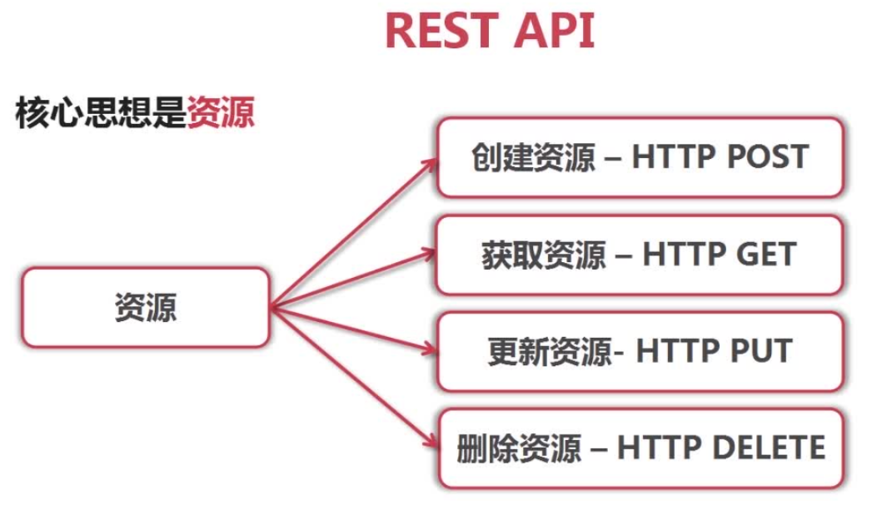
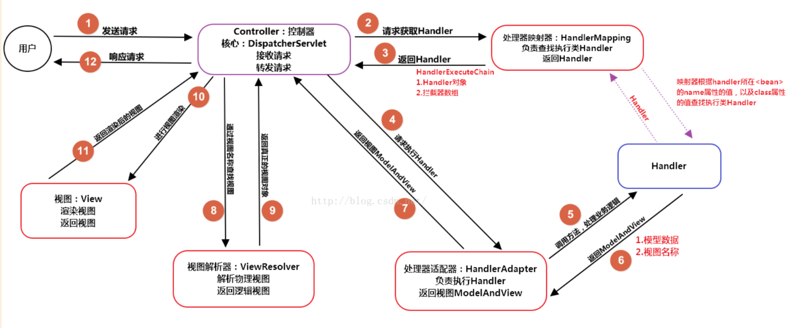
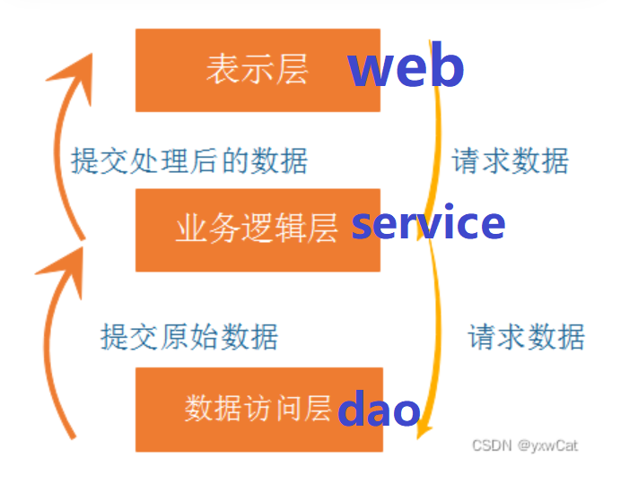
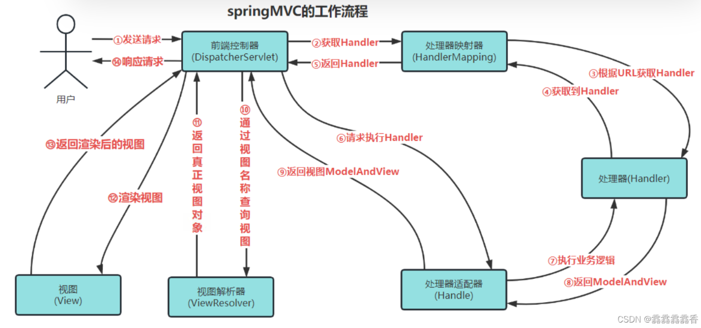
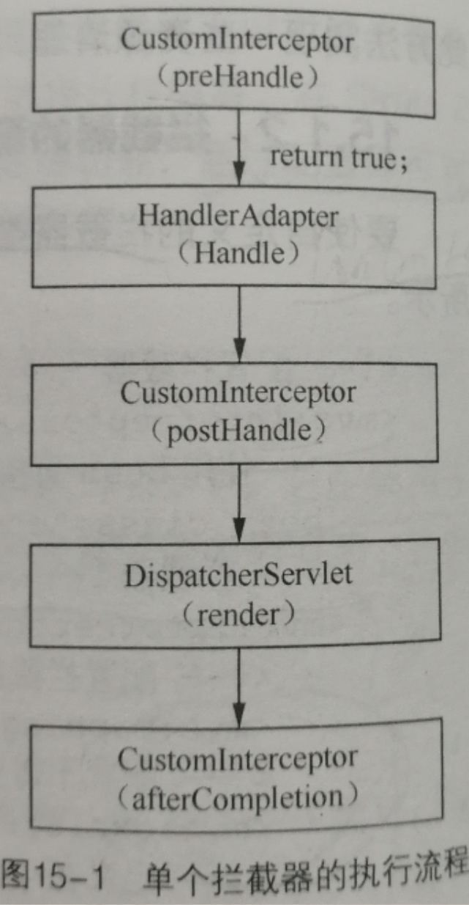
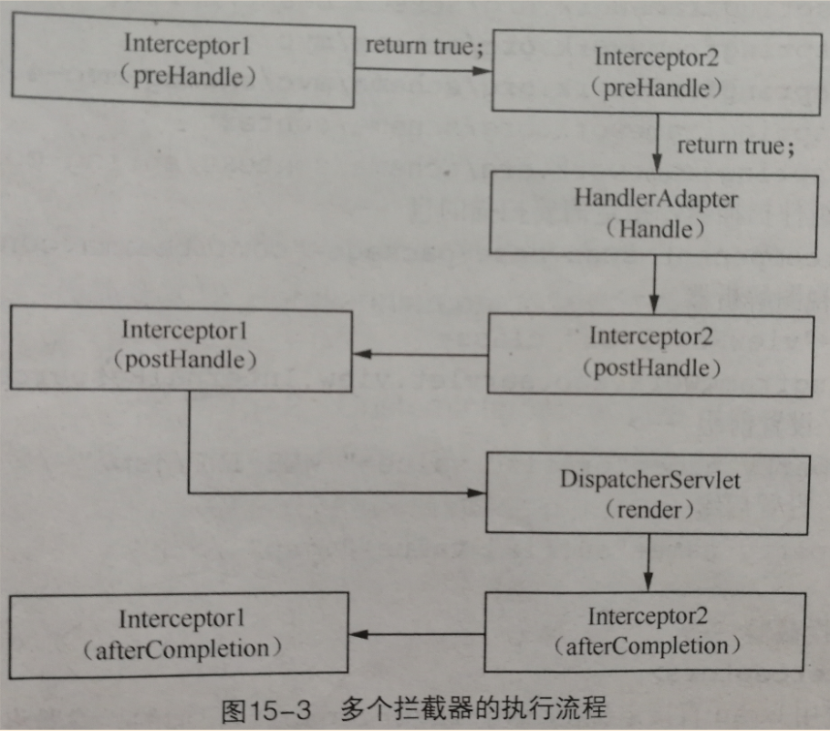
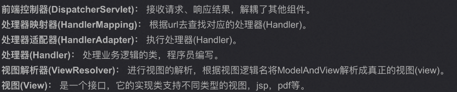

<!--
 * @Description: 
 * @Author: ljl
 * @Date: 2025-04-07 17:05:59
 * @LastEditors: rendc
 * @LastEditTime: 2025-04-10 18:48:28
-->
## 目录
- [Spring MVC的主要组件？](#spring-mvc的主要组件)
- [POST请求中文乱码问题处理？](#post请求中文乱码问题处理)
- [简述用于处理不同类型的传入HTTP请求方法的注释 ？](#简述用于处理不同类型的传入http请求方法的注释-)
- [Spring MVC里面拦截器是怎么写的？](#spring-mvc里面拦截器是怎么写的)
- [Spring,Spring MVC,Spring Boot 之间什么关系?](#springspring-mvcspring-boot-之间什么关系)
- [请描述Spring MVC的工作流程？描述一下 DispatcherServlet 的工作流程？](#请描述spring-mvc的工作流程描述一下-dispatcherservlet-的工作流程)
- [Spring MVC和Spring Boot之间的区别是什么？](#spring-mvc和spring-boot之间的区别是什么)
- [什么是Spring MVC？简单介绍下你对Spring MVC的理解？以及有什么优点？](#什么是spring-mvc简单介绍下你对spring-mvc的理解以及有什么优点)
- [SpringMVC工作原理或流程是什么？](#springmvc工作原理或流程是什么)
- [Spring MVC与Struts2区别](#spring-mvc与struts2区别)
- [拦截器执行流程？](#拦截器执行流程)
- [简述Spring MVC中@PathVariable注释的作用 ？](#简述spring-mvc中pathvariable注释的作用-)
- [@Controller注解的作用](#controller注解的作用)
- [SpringMVC重要组件及其作用是什么？](#springmvc重要组件及其作用是什么)
- [简述@RestController 和 @Controller 有什么区别？](#简述restcontroller-和-controller-有什么区别)
- [Spring MVC 中的适配器模式（为什么要在 Spring MVC 中使用适配器模式？）](#spring-mvc-中的适配器模式为什么要在-spring-mvc-中使用适配器模式)

**试题 1**
# Spring MVC的主要组件？
**1.前端控制器 DispatcherServlet（不需要程序员开发）**
- 作用：接收请求、响应结果，相当于转发器，有了 `DispatcherServlet` 就减少了其它组件之间的耦合度。 

**2.处理器映射器HandlerMapping（不需要程序员开发）** 
- 作用：根据请求的URL来查找 `Handler` 

**3.处理器适配器HandlerAdapter** 
- 注意：在编写 `Handler` 的时候要按照 `HandlerAdapter` 要求的规则去编写，这样适配器 `HandlerAdapter` 才可以正确的去执行 `Handler` 。 

**4.处理器Handler（需要程序员开发）**

**5.视图解析器 ViewResolver（不需要程序员开发）**
- 作用：进行视图的解析，根据视图逻辑名解析成真正的视图（view）

**6.视图View**
- View是一个接口， 它的实现类支持不同的视图类型（jsp，freemarker，pdf等等）

**试题 2**
# POST请求中文乱码问题处理？
* POST 请求的中文乱码通常是由于请求体的编码未正确设置导致的。可以通过设置request对象的编码来解决。

* GET 请求的中文乱码通常是由于 URL 编码的问题。可以在服务器端对获取的参数进行解码

**试题 3**
# 简述用于处理不同类型的传入HTTP请求方法的注释 ？
在Spring MVC中，处理不同类型的传入HTTP请求方法主要通过以下几种注释（注解）来实现：
* **@GetMapping**：这个注解用于处理HTTP GET请求。它通常用于`检索数据`。从服务器`获取某些信息`时，发送一个GET请求，然后在对应的Controller方法上使用@GetMapping注解。
  
* **@PostMapping**：这个注解用于处理HTTP POST请求。它通常用于`提交数据`，在`表单提交`时。点击提交按钮时，浏览器会向服务器发送一个POST请求，服务器上的Controller中对应的方法会使用@PostMapping注解来处理这个请求。

* **@PutMapping**：这个注解用于处理HTTP PUT请求。PUT请求通常用于`更新资源`。在RESTful API中，PUT请求是更新资源状态的一种常见方式。

* **@DeleteMapping**：这个注解用于处理HTTP DELETE请求。顾名思义，它通常用于`删除资源`。和PUT请求类似，HTML表单也不直接支持DELETE方法，但在RESTful API中，DELETE请求用于删除资源。

* **@PatchMapping**：这个注解用于处理HTTP PATCH请求。PATCH请求用于对`资源进行部分修改`。在RESTful API设计中，如果你只需要更新资源的一部分属性，而不是全部，那么可以使用PATCH请求。

* **@RequestMapping**：这个注解是一个更通用的注解，它可以用来`处理所有类型`的HTTP请求。你可以通过指定method属性来限制它只处理特定类型的请求。例如，@RequestMapping(method = RequestMethod.GET)等同于@GetMapping。

RESTful 是REST（表述性状态转移）架构风格的API设计方式，通常用于后见`分布式系统`


**试题 4**
# Spring MVC里面拦截器是怎么写的？
第一种通过实现HandleInterceptor接口，或者继承HandleInterceptor接口的实现类HandleInterceptorAdapter来定义；

第二种通过实现WebRequestInterceptor接口，或继承WebRequestInterceptor接口的实现类来定义。

**1.拦截器的定义：以实现HandleInterceptor接口为例：**
```java
    public class LoginInterceptor implements HandlerInterceptor {

        @Override
        public boolean preHandle(HttpServletRequest request, HttpServletResponse response, Object handler) throws Exception {
            //做一些操作 方法返回类型为布尔值
            return false;
        }
    
        @Override
        public void postHandle(HttpServletRequest request, HttpServletResponse response, Object handler, ModelAndView modelAndView) throws Exception {
            //做一些操作
        }
    
        @Override
        public void afterCompletion(HttpServletRequest request, HttpServletResponse response, Object handler, Exception ex) throws Exception {
            //做一些操作
        }
    }
```
从以上可以看出，自定义的拦截器类实现了HandlerInterceptor接口，并且实现了接口中的三个方法。对这三个方法解释如下：

**（1）preHandle()方法**

该方法会在控制器方法前执行，其返回值表示是否中断后续操作。当返回值为`true`时，表示`继续向下执行`；当返回值为`false`时，会`中断后续`的所有操作（包括调用下一个拦截器和控制器类中的方法执行等）。

**（2）postHandle()方法**

该方法会在控制器方法调用之后，且解析视图之前执行。可以通过此方法对请求域中的模型和视图做出进一步的修改。

**（3）afterCompletion()方法**

该方法会在整个请求完成，即视图渲染结束之后执行。可以通过此方法实现一些资源清理、记录日志信息等工作。

**2.拦截器的配置**

要使自定义的拦截器类生效，还需要在springmvc的配置文件中进行配置。配置如下所示：
```html
 <!-- 配置拦截器 -->
 <mvc:interceptors>
     <!-- 使用bean直接定义在<mvc:interceptors>下面的Interceptor将拦截所有请求 -->
     <bean class="com.config.AllInterceptor"/>
     
     <!-- 拦截器1 -->
     <mvc:interceptor>
         <!-- 配置拦截器作用的路径，/**表示拦截所有路径 -->
         <mvc:mapping path="/**"/>   
         <!-- 配置不需要拦截器作用的路径 /admin表示放行所有以/admin结尾的路径 -->
         <mvc:exclude-mapping path="/admin"/>    
         <!-- 定义在<mvc:interceptor>下面的Interceptor，表示对匹配路径的请求才进行拦截 -->
         <bean class="com.config.AdminInterceptor"/>
     </mvc:interceptor>
     
     <!-- 拦截器2 -->
     <mvc:interceptor>
         <mvc:mapping path="/index/**"/>
         <bean class="com.config.IndexInterceptor"/>
     </mvc:interceptor>
     
      <!-- 后面可以配置多个拦截器-->
     </mvc:interceptors>
```
`需要注意的是在进行配置拦截器时，必须按照如上的顺序进行配置，否则拦截器将失效。`


**试题 5**
# Spring,Spring MVC,Spring Boot 之间什么关系?
**Spring**：Java开发框架

**Spring MVC**：是Spring框架的一个模块，在web层的开发应用

**Spring Boot**：用于简化 Spring 应用开发和部署的工具，它可以帮助开发者快速搭建基于 Spring 和 Spring MVC 的应用，提高开发效率。

**试题 6**
# 请描述Spring MVC的工作流程？描述一下 DispatcherServlet 的工作流程？
* （1）用户发送请求至前端控制器`DispatcherServlet`； 

* （2） `DispatcherServlet`收到请求后，调用`HandlerMapping`处理器映射器，请求获取`Handle`； 

* （3）处理器映射器根据请求url找到具体的处理器，生成处理器对象及处理器拦截器(如果有则生成)一并返回给`DispatcherServlet`；

* （4）`DispatcherServlet` 调用 `HandlerAdapter`处理器适配器；

* （5）`HandlerAdapter` 经过适配调用具体处理器( `Handler` ，也叫后端控制器)；

* （6）`Handler`执行完成返回`ModelAndView`；

* （7）`HandlerAdapter`将`Handler`执行结果`ModelAndView`返回给`DispatcherServlet`；

* （8）`DispatcherServlet`将`ModelAndView`传给`ViewResolver`视图解析器进行解析；

* （9）`ViewResolver`解析后返回具体`View`； 

* （10）`DispatcherServlet`对`View`进行渲染视图（即将模型数据填充至视图中）

* （11）`DispatcherServlet`响应用户。



**试题 7**
# Spring MVC和Spring Boot之间的区别是什么？
Spring MVC和Spring Boot是Spring生态系统中的两个重要部分，它们之间的主要区别如下：

**1.定位不同：**

* Spring MVC是一个Web框架，用于构建Web应用程序。

* Spring Boot是一个基于Spring的开发框架，旨在简化Spring应用的创建和开发过程。

**2.配置方式：**

* Spring MVC需要配置大量的XML或Java配置，如DispatcherServlet、视图解析器等。

* Spring Boot提供自动配置，大大简化了配置过程，无需进行繁琐的配置。

**3.嵌入式服务器：**

* Spring MVC通常需要部署在外部的Servlet容器中。

* Spring Boot内嵌了Servlet容器（如Tomcat），使得应用可以独立运行。

**4.用途：**

* Spring MVC主要用于Web应用的视图和控制层。

* Spring Boot可以用于各种类型的Spring应用，包括Web应用。

**试题 8**
# 什么是Spring MVC？简单介绍下你对Spring MVC的理解？以及有什么优点？
***三层架构*** 

一种**轻量级的**、**基于MVC的Web层应用框架**。偏前端而不是基于业务逻辑层，是Spring框架的一个后续产品。通过把模型-视图-控制器分离，将web层进行职责解耦，把复杂的web应用分成逻辑清晰的几部分，简化开发，减少出错，方便组内开发人员之间的配合。

Spring MVC是一种**分层设计思想**，目标是将复杂的应用系统按照分层处理进行设计和规划,通过这种设计方式达到分而治之的效果,从而降低程序开发的难度,提高代码的可维护性. Spring MVC核心类是 DispatcherServlet ，它是一个 Servlet，顶层是实现的Servlet接口。

**Spring MVC的优点：**
* （1）可以支持各种视图技术,而不仅仅局限于JSP； 

* （2）与Spring框架集成（如IoC容器、AOP等）； 

* （3）清晰的角色分配：前端控制器(DispatcherServlet) , 请求到处理器映射（handlerMapping）, 处理器适配器（HandlerAdapter）, 视图解析器（ViewResolver）。 

* （4）支持各种请求资源的映射策略。

**试题 9**
# SpringMVC工作原理或流程是什么？
Spring MVC 的工作原理和流程可以分为多个步骤，从用户请求的接收到响应的生成，每个步骤都有其特定的组件和功能。以下是 Spring MVC 的工作流程详细解析：

**工作流程**

**1.用户请求**：

* 用户通过浏览器或客户端发起请求，通常是一个 HTTP 请求，包含一些参数和请求信息。

**2.前端控制器（DispatcherServlet）**：
  * 所有请求首先到达 DispatcherServlet，这是 Spring MVC 的中央控制器，它负责处理请求和响应的整个流程。

**3.处理器映射器（HandlerMapping）**：
* DispatcherServlet 会根据请求的 URL 调用 HandlerMapping，查找与该请求相匹配的处理器（Handler）。

* HandlerMapping 可以通过多种方式进行匹配，如基于注解（@RequestMapping）、XML 配置等。

**4.处理器适配器（HandlerAdapter）**：
* 一旦找到合适的处理器，DispatcherServlet 将调用 HandlerAdapter，将请求发送到找到的处理器。

* HandlerAdapter 的作用是将处理器适配到 Spring MVC 中，允许不同类型的处理器被处理。

**5.处理请求（Handler）**：
* 所有业务逻辑都由具体的 Handler（通常是 Controller）来处理。它处理请求，执行相应的业务逻辑，并返回一个 ``ModelAndView`` 对象。

* `ModelAndView` 对象包含模型数据和视图的名称，模型数据将被传递到视图中进行展示。

**6.视图解析器（ViewResolver）**：    
* DispatcherServlet 使用 ViewResolver 将 Controller 返回的视图逻辑名解析成实际的视图实现（如 JSP、Thymeleaf、FreeMarker 等）。

* 视图解析器根据配置（如前缀、后缀）组合成真实的视图路径。

**7.生成响应（View）：**

* 一旦解析出视图，Spring MVC 会将模型数据传递给视图，视图将渲染出最终的 HTML 页面或其他类型的响应（如 JSON、PDF 等）。

* 渲染完成后，生成的响应会返回到 DispatcherServlet。

**8.返回响应给用户：**

* DispatcherServlet 将视图的最终输出（如 HTML 页面或其他格式的响应数据）返回给用户的浏览器或客户端。


**试题 10**
# Spring MVC与Struts2区别
* **相同点** 都是基于mvc的表现层框架，都用于web项目的开发。

* **不同点**
    * **前端控制器**：SpringMVC 是 Servlet（DispatcherServlet），Struts2 是 Filter（StrutsPreparedAndExcutorFilter）。

    * **请求参数接收**：SpringMVC 用方法形参，基于方法开发，线程安全，推荐单例；Struts2 用类成员变量，基于类开发，线程不安全，只能多例。

    * **数据处理**：Struts 用值栈和 OGNL 存取数据；SpringMVC 用参数解析器给方法形参赋值，封装 ModelAndView，通过 request 域传数据，Jsp 视图解析器默认用 Jstl。
    * **与 Spring 整合**：SpringMVC 是 Spring 一部分，无需整合，企业项目使用多。
    * **Struts2 特点**：类级别拦截，每次请求创建 action，属性被方法共享，只能多例，无法用注解开发，有线程安全问题。通过类属性或模型驱动接收参数，用值栈和 OGNL 获取值，有自定义拦截机制，配置文件大。
    * **Spring MVC 特点**：方法级别拦截，请求对应方法，参数封装到方法参数，对象参数加 @RequestBody。controller 默认单例，可用注解开发。通过方法参数 model 设返回值，页面用 el 表达式获取，有独立 AOP 拦截机制。

**试题 11**
# 拦截器执行流程？

* **单个拦截器**：程序先执行拦截器的 preHandle() 方法，返回 true 则继续执行处理器方法，否则停止。业务处理器处理完请求后，执行 postHandle() 方法，接着 DispatcherServlet 返回响应，最后执行 afterCompletion() 方法。执行流程为：preHandle() → 控制器方法 → postHandle() → afterCompletion()。


* **多个拦截器**：以 Spring MVC 配置文件中配置 Interceptor1 和 Interceptor2 且 Interceptor1 在前为例，preHandle() 方法按配置顺序执行，postHandle() 和 afterCompletion() 方法按配置顺序反序执行。执行流程为：preHandle1 → preHandle2 → 控制器方法 → postHandle2 → postHandle1 → afterCompletion2 → afterCompletion1 。即多个拦截器时，preHandle 按次序执行，其余方法反序执行。


**试题 12**
# 简述Spring MVC中@PathVariable注释的作用 ？

在 Spring MVC 里，`@PathVariable` 注解可将 URL 中的模板变量（URI 变量）绑定到控制器方法参数。当使用 RESTful 风格 URL，其中部分内容随用户请求变化，且要将变化部分作为参数传入控制器方法时，可使用该注解。
* 例如，获取特定用户信息的 URL 为 /users/575，其中 575 是 URI 变量。当接收到 /users/123 请求时，123 就是 userId 的具体值。在控制器方法中使用 @PathVariable 注解获取该值：

```java
@RequestMapping(value = "/users/575", method = RequestMethod.GET)
public String getUser(@PathVariable("userId") Long userId, Model model) {
    // 用 userId 获取用户信息并添加到模型
    return "userDetails";
}
```
这里 @PathVariable("userId") 会让 Spring MVC 从 URL 提取对应值，转为 Long 类型后传给 userId 参数。
若 URI 变量名和方法参数名相同，可省略 @PathVariable 中的值：
```java
@RequestMapping(value = "/users/575", method = RequestMethod.GET)
public String getUser(@PathVariable Long userId, Model model) {
    // ...
    return "userDetails";
}
```
此时 Spring MVC 会自动匹配 URI 变量和方法参数。

**试题 13**
# @Controller注解的作用

在 Spring MVC 中，控制器 `Controller` 处理 `DispatcherServlet` 分发的请求，将处理后的数据封装成 `Model` 交给 `View` 展示。定义 `Controller` 很简便，无需继承特定类或实现接口，用 `@Controller` 标记类，结合 `@RequestMapping`、`@RequestParam` 等注解定义 URL 与方法的映射，即可被外界访问，且不直接依赖 `HttpServletRequest` 和 `HttpServletResponse，可通过方法参数获取。`

`@Controller` 标记的类是 Spring MVC 的控制器对象，分发处理器会扫描其使用 `@RequestMapping` 注解的方法。不过仅用 `@Controller` 标记还不够，需让 Spring 管理该类，有两种方式：一是在配置文件定义 bean 对象；二是在配置文件指定查找 `@Controller` 标记类的位置。

使用 `@Controller` 注解步骤如下：
1. **创建控制器类**：创建 Java 类并用 @Controller 标注。
```java
@Controller
public class HelloController {
    @GetMapping("/hello")
    public String hello() {
        return "hello";
    }
}
```
2. **编写控制器方法**：在控制器类中编写处理请求、返回响应的方法，可用注解指定请求 URL、方法等参数。如 `@GetMapping("/hello")` 指定请求 URL，返回 “hello” 表示渲染同名视图。
3. **配置视图解析器**：为将视图名称解析为实际视图，需配置视图解析器。
```java
@Bean
public ViewResolver viewResolver() {
    InternalResourceViewResolver resolver = new InternalResourceViewResolver();
    resolver.setPrefix("/WEB-INF/views/");
    resolver.setSuffix(".jsp");
    return resolver;
}
```
上述代码将前缀设为 `/WEB-INF/views/`，后缀设为 `.jsp`，当返回 “hello” 时，会解析为 `/WEB-INF/views/hello.jsp`。

4. **启动应用程序**：启动应用后访问 http://localhost:8080/hello 可看到视图内容。
```java
@SpringBootApplication
public class MyApp {
    public static void main(String[] args) {
        SpringApplication.run(MyApp.class, args);
    }
}
```
**试题 14**
# SpringMVC重要组件及其作用是什么？


**试题 15**
# 简述@RestController 和 @Controller 有什么区别？
在 Spring MVC 里，@Controller和@RestController都用于标识类为 Spring MVC 的 controller 处理器，能接收 HTTP 请求，但二者有别：
* **返回类型：**@Controller用于接收请求并返回视图（如 HTML、JSP），适用于 MVC 模式。其方法返回String、ModelAndView、Map<String, Object>等，用于填充视图。@RestController则用于返回数据（JSON、XML 等），它是@Controller与@ResponseBody的组合。该注解下的方法只能返回 Java Bean、基本数据类型等，Spring 会自动转为 JSON 或 XML 格式。
  
* **视图解析：**@Controller可配合InternalResourceViewResolver视图解析器解析并跳转 JSP、HTML 页面。@RestController因主要返回数据，无法返回指定页面，视图解析器也不起作用。

总之，需返回 HTML 页面用@Controller；需返回 JSON、XML 等数据则用@RestController 。

**试题 16**
# Spring MVC 中的适配器模式（为什么要在 Spring MVC 中使用适配器模式？）
在 Spring MVC 中，DispatcherServlet 根据请求信息调用 HandlerMapping，解析请求对应的 Handler。解析到对应的 Handler（也就是我们平常说的 Controller 控制器）后，开始由HandlerAdapter 适配器处理。HandlerAdapter 作为期望接口，具体的适配器实现类用于对目标类进行适配，Controller 作为需要适配的类

Spring MVC 中的 Controller 种类众多，不同类型的 Controller 通过不同的方法来对请求进行处理。如果不利用适配器模式的话，DispatcherServlet 直接获取对应类型的 Controller，需要的自行来判断，像下面这段代码一样：
```
 if(mappedHandler.getHandler() instanceof MultiActionController){
    ((MultiActionController)mappedHandler.getHandler()).xxx
 }else if(mappedHandler.getHandler() instanceof XXX){
     ...
 }else if(...){
    ...
 }
```
假如我们再增加一个 Controller类型就要在上面代码中再加入一行 判断语句，这种形式就使得程序难以维护，也违反了设计模式中的开闭原则 – 对扩展开放，对修改关闭。