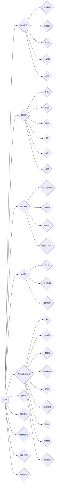

<!--
 * @Description: 
 * @Author: ljl
 * @Date: 2025-04-10 19:40:58
 * @LastEditors: rendc
 * @LastEditTime: 2025-04-11 14:18:12
-->

```mermaid
graph LR;
A(JAVA) --> B{java语言}
A --> C{数据库}
A --> D{Web开发}
A --> E{中间件}
A --> F{算法与数据结构}
A --> G{分布式}
A --> H{操作系统}
A --> I{计算机网络}
A --> J{设计模式}
A --> K{场景应用}

B --> L{java基础}
B --> M{集合类}
B --> N{IO流}
B --> O{多线程}
B --> P{JVM} 

C --> Q{SQL}
C --> R{索引}
C --> S{事务}
C --> T{锁}
C --> U{优化}
C --> V{其他}

D --> W{Spring Boot}
D --> X{Spring}
D --> Y{MyBatis}
D --> Z{Spring MVC}

E --> AA{Redis}
E --> AB{消息队列}
E --> AC{搜索引擎}

F --> AD{树}
F --> AE{堆与栈}
F --> AF{递数组}
F --> AG{排序算法}
F --> AH{哈希}
F --> AI{动态规划}
F --> AJ{链表}
F --> AK{字符串}
F --> AL{高级算法}
```